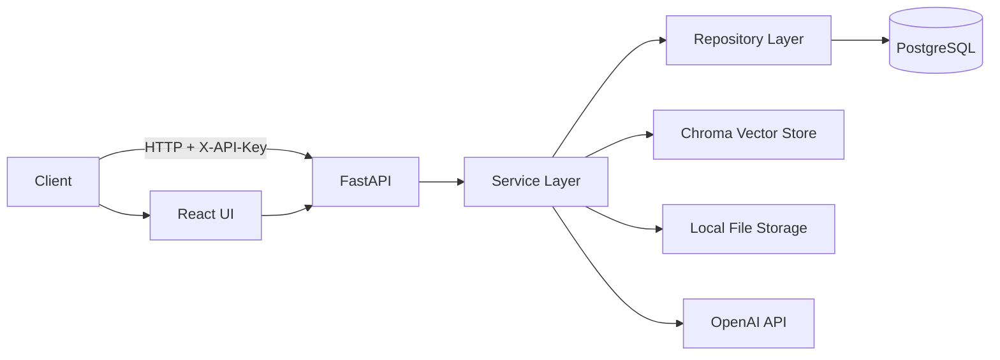

# Enterprise Knowledge Service (EKS)

EKS is a startup-grade backend service for multi-tenant knowledge bases with document ingestion and Retrieval-Augmented Generation (RAG) over private documents.

## Architecture



## Features

- Multi-tenant knowledge bases
- Document upload (PDF, TXT, Markdown)
- Ingestion pipeline (chunk + embed + store)
- RAG query with citations
- API key authentication
- Structured logging
- React UI for querying

## Setup

1. Copy environment template and fill values.
2. Start the stack with Docker Compose.

```bash
docker compose up --build
```

The API will be available at `http://localhost:8000`.
The UI will be available at `http://localhost:5173`.

## Environment Variables

- `OPENAI_API_KEY`: OpenAI API key
- `OPENAI_EMBED_MODEL`: embedding model (default `text-embedding-3-small`)
- `OPENAI_GEN_MODEL`: generation model (required for query)
- `DATABASE_URL`: PostgreSQL connection string
- `CHROMA_PATH`: local Chroma directory
- `STORAGE_PATH`: document storage directory
- `APP_ENV`: environment name
- `API_KEY`: API key for requests
- `CHUNK_SIZE`: chunk size in characters (default 800)
- `CHUNK_OVERLAP`: overlap in characters (default 100)

## API Usage Examples

Create a knowledge base:

```bash
curl -X POST http://localhost:8000/api/v1/knowledge-bases \
  -H "X-API-Key: changeme" \
  -H "Content-Type: application/json" \
  -d '{"name":"Engineering","description":"Internal docs"}'
```

Upload a document:

```bash
curl -X POST "http://localhost:8000/api/v1/knowledge-bases/<kb_id>/documents" \
  -H "X-API-Key: changeme" \
  -F "file=@./docs/handbook.pdf"
```

Ingest documents:

```bash
curl -X POST "http://localhost:8000/api/v1/knowledge-bases/<kb_id>/ingest" \
  -H "X-API-Key: changeme"
```

Query:

```bash
curl -X POST "http://localhost:8000/api/v1/knowledge-bases/<kb_id>/query" \
  -H "X-API-Key: changeme" \
  -H "Content-Type: application/json" \
  -d '{"question":"What is our security policy?","top_k":5}'
```

## UI (Local Dev)

```bash
cd web
npm install
npm run dev
```

## Design Decisions

- Clean architecture separation: routes -> services -> repositories
- Chroma for local persistent vector storage
- Postgres for metadata, chunk tracking, ingestion status
- OpenAI integration isolated in `OpenAIService`
- Config-driven chunking parameters

## Testing

```bash
pytest
```

## Future Improvements

- Background job queue for ingestion
- Rate limiting
- Better chunking strategies and metadata filters
- Streaming responses for query
- Per-tenant encryption at rest
